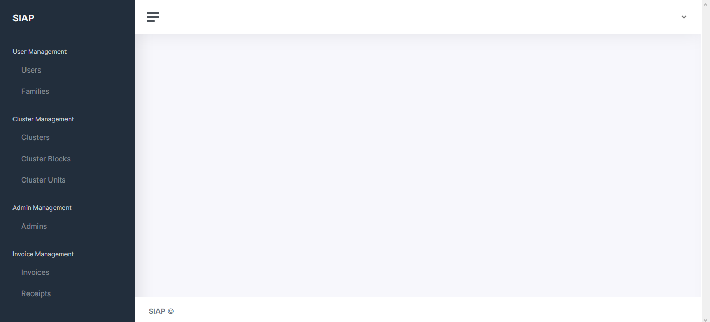

# Salam Zero

You can use our pre-configured installation on https://github.com/imam/salam-zero

# HOW TO INSTALL

## Make sure you can clone these repo with SSSH
Before installing, please make sure that you can clone https://github.com/imam/salam-laravel and https://github.com/imam/salam-js WITH SSH.

## Adding  to composer

On your Laravel installation's `composer.json`, add

```json
"repositories": [{
    "type": "vcs",
    "url":  "git@github.com:imam/salam-laravel.git"
}]
```
Then run: `composer require imam/salam`

After that, run `php artisan vendor:publish --provider="Imam\Salam\SalamProvider"`

## Adding Inertia (Laravel)

Run `composer require inertiajs/inertia-laravel`.

Then `php artisan vendor:publish --provider="Inertia\ServiceProvider"`

After that, please run `php artisan inertia:middleware`

Then go to the created middleware (`HandleInertiaRequest`), and then change the `$rootView` to `vendor/salam/main`. It will make that our Inertia view to default to our published salam's view one from the previous step.

Then, go to `App\Http\Kernel`, and add `\App\Http\Middleware\HandleInertiaRequests::class` to the `web` group:

```php
'web' => [
    // ...
    \App\Http\Middleware\HandleInertiaRequests::class,
],
```

## Adding Ziggy
Ziggy is our helper library to use with Inertia

```bash
composer require tightenco/ziggy
```

## Adding Inertia And Vue (JS)

Run `npm install @inertiajs/inertia @inertiajs/inertia-vue vue imam/salam-js`

For simplicity sake, just copy paste below code to `app.js`, if you understand Vue, you can customize these as much as you like :)

```js
import { App, plugin } from '@inertiajs/inertia-vue'
import {Main} from 'salam-js'
import Vue from 'vue'
Vue.prototype.$route = route

require('./bootstrap');
Vue.use(plugin)
Vue.component('main-layout', Main.default)

const el = document.getElementById('app')

new Vue({
  render: h => h(App, {
    props: {
      initialPage: JSON.parse(el.dataset.page),
      resolveComponent: name => require(`./Pages/${name}`).default,
    },
  }),
}).$mount(el)
```

Then on `webpack.mix.js`, add `.vue()` at the end of `mix` pipeline:
```js
const mix = require('laravel-mix');

mix.js('resources/js/app.js', 'public/js')
    .postCss('resources/css/app.css', 'public/css', [
        //
    ])
    .vue();
```

Then, create new folder in `resources/js` named `Pages`, after that, create new file named `Example.vue`, and fill it with these:

```vue
<template>
    <main-layout>
    </main-layout>
</template>
```

After all done, run `npm install`, then `npm run dev`. You should see your terminal installing several required dependencies. Everytime the installer exit with this line `Finished. Please run Mix again.`, just run `npm run dev` again.

## Add new route
Change the root route (`/`) on `routes/web.php` to:

```php
Route::get('/', function () {
    return \Inertia\Inertia::render('Example');
});
```

Then run your server, then go to your root URL

